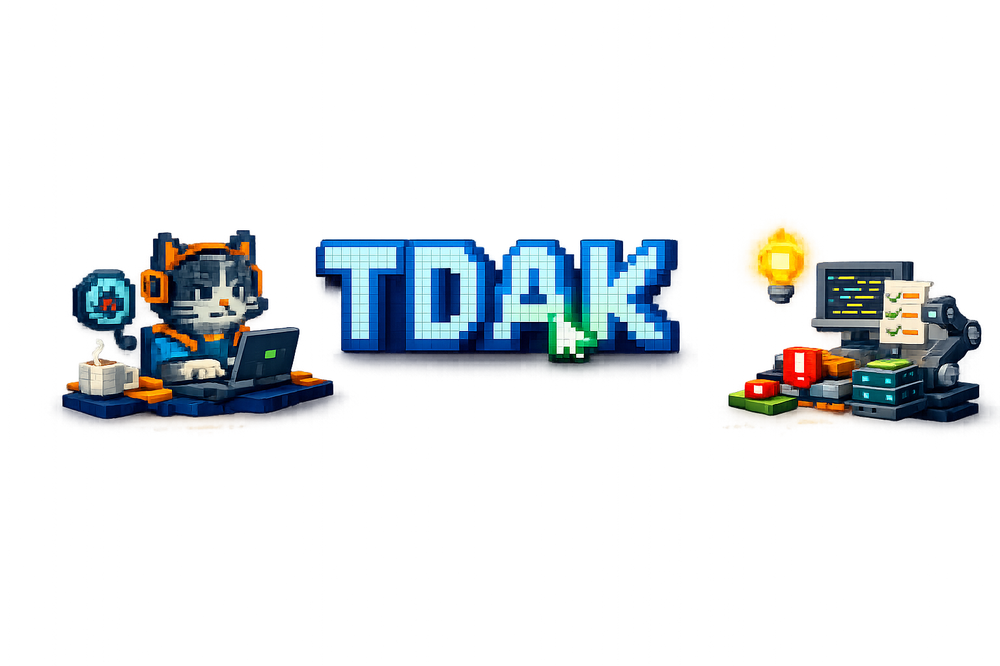

# True Developer Agent Kit (TDAK)

TDAK helps developers understand codebases, implement good practices, and
write better code. It's a human-centric kit. The goal
is to provide a solid developer experience and increase developer
productivity by providing fast tools to review code, surface missing context,
and build synergy with LLMs.

## Why TDAK

- Code speed: We don't need to write 100k LoC, but we can use LLMs to write boilerplate for us;
- Review speed: teams lose productivity reviewing low-quality code. TDAK agents don't write too much, and they help developers ship faster by providing information about solutions.

If an agent cannot explain how the codebase works, it should not be generating
massive diffs. *TDAK takes that seriously*.

Writing code is still a core part of development. You can say "but LLMs are faster", but good inference projects must have strong context engineering. From time to time, writing a prompt to do the feature, fixing issues, and telling the LLM what to do is much slower than actually writing a solution.

## What the agents do

TDAK agents do not try to write lots of code. They are tuned for:

- Researching topics and gathering evidence
- Finding bugs and risky code
- Assisting with debugging and root-cause analysis
- Producing focused, high-signal recommendations
- Helping with architectural solutions

## Non-goals

- Autogenerating large, speculative features
- Flooding pull requests with unreadable changes
- Replacing developers or skipping code understanding

## Agents

- Critic: structured code review and issue discovery
- Surfer: web research with citations

See `agents/` for the agent definitions.
